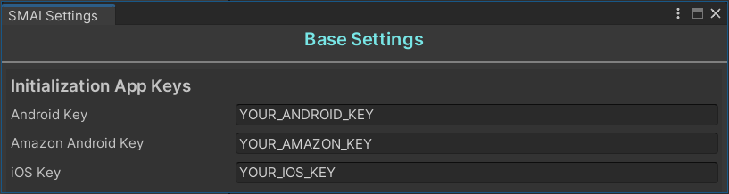

#  SMAI APPODEAL
[](LICENSE)
[](package.json)
[](https://unity.com/releases/editor/archive)

**SMAIL Appodeal** is to speed up the integration of Appodeal Ad SDK into your project with a user-friendly api that reduces unnecessary lines of code.

Before importing this package, you should install the Appodeal SDK following their [official documentation](https://docs.appodeal.com/ru/unity/get-started) to avoid possible errors.

# Installation

**As a Unity module:**

Supports installation as a Unity module via a git link in the **Package Manager**
```
https://github.com/MrVeit/Veittech-SMAI-Appodeal.git
```
or direct editing of `Packages/manifest.json`:
```
"com.veittech.smai.appodeal": "https://github.com/MrVeit/Veittech-SMAI-Appodeal.git",
```
**As source:**

[Download a latest version via .unityPackage here](https://github.com/MrVeit/Veittech-SMAI-Appodeal/releases)

# Initialization

First of all, you need to initialize the plugin before the first display of ads as follows.
**For an explicit understanding** of what the standard Appodeal SDK initialization looks like without and with SMAI, two implementations are shown below:

**STANDARD APPODEAL INITIALIZATION:**
```c#
public sealed class StandartAppodealIntegration : MonoBehaviour
{
    private const string ANDROID_APP_KEY = "86d0aa6e8153464944aba4856a59d64a16b99b9f7588f14d";
    private const int AD_TYPES = AppodealAdType.Interstitial | AppodealAdType.RewardedVideo |
                                 AppodealAdType.Banner | AppodealAdType.Mrec;

    public void Init()
    {
        Appodeal.SetTesting(true);
        Appodeal.SetUseSafeArea(true);
        Appodeal.MuteVideosIfCallsMuted(true)

        AppodealCallbacks.Sdk.OnInitialized += OnInitializationFinished;

#if UNITY_ANDROID
        Appodeal.Initialize(ANDROID_APP_KEY, AD_TYPES);
#endif
    }

    public void OnInitializationFinished(object sender, SdkInitializedEventArgs e)
    {
        //Do something

        AppodealCallbacks.Sdk.OnInitialized -= OnInitializationFinished;
    }
}
```

**IMPLEMENTATION OF APPODEAL INITIALIZATION WITH SMAI:**
```c#
public sealed class SMAIAppodealIntegration : MonoBehaviour
{
    private const int AD_TYPES = AppodealAdType.Interstitial | AppodealAdType.RewardedVideo
                               | AppodealAdType.Banner | AppodealAdType.Mrec;

    public void Init()
    {
        var androidKey = new AdInitializationKeys().GetAndroidKey();

        var adConfigWithoutCallback = new AdConfigAdapter.Builder(androidKey, AD_TYPES)
            .WithTestMode()
            .WithSafeArea()
            .WithMuteVideoAd()
            .Build();

        var adConfigWithCallback = new AdConfigAdapter.Builder(androidKey, AD_TYPES)
            .WithTestMode()
            .WithSafeArea()
            .WithMuteVideoAd()
            .Build((isSuccess, errorMessages) =>
            {
                Debug.Log($"[SMAI Appodeal] Appodeal SDK initialization finished with:" +
                    $" Status: {isSuccess}");

                if (isSuccess)
                {
                    //Do something
                }
            });
    }
}
```

The **AD_TYPES** constant specifies the types of advertisements that will be used
in the project (if you doubt that one of the advertisement types will be used, it is better to delete it **to avoid generating unnecessary requests** to the Appodeal SDK).

### Setting initialization key values

In order for the Appodeal SDK to work correctly on two platforms, you need to initialize the application keys that are created [in the dashboard](https://app.appodeal.com/apps) on the Appodeal website. 
To do this, you need to set their values using the SMAI Appodeal settings window, which can be found at `SMAI -> Appodeal -> Settings`, having previously created them in the dashboard. 

<p align="center">
 
</p>

**IMPORTANT**: For correct work of Appodeal SDK and avoiding ARN errors. It is necessary to **NOT DESTROY** the initialization config 
for advertising between scenes via the `DontDestroyOnLoad(gameObject)` method after its initialization.

For example, if you have a project published under Google Play and App Store, the initialization method will have the following form:
```c#
public void Init()
{
    var keysStorage = new AdInitializationKeys();

    var androidKey = keysStorage.GetAndroidKey();
    var iosKey = keysStorage.GetIosKey();

    var adConfig = new AdConfigAdapter.Builder(androidKey, AD_TYPES)
        .WithIOSAppKey(iosKey)
        .WithTestMode()
        .WithSafeArea()
        .WithMuteVideoAd()
        .Build();

    DontDestroyOnLoad(gameObject);
}
```

### Banner configuration

For detailed configuration of banner ads there are 3 following initialization methods, 
which you can read about in detail in the official Appodeal SDK documentation, in the section [about banner ads](https://docs.appodeal.com/unity/ad-types/banner#enable-728x90-banners) 

```c#
public void Init()
{
    var androidKey = new AdInitializationKeys().GetAndroidKey();

    var adConfig = new AdConfigAdapter.Builder(androidKey, AD_TYPES)
        .WithTestMode()
        .WithBannerAnimation()
        .WithSmartBanners()
        .WithTabletBanners()
        .Build();
}
```

### Activation automatic ad caching

To activate automatic caching of advertisements for banners, you should use the following methods:
`WithAutoCacheBannerAd()` and `WithAutoCacheMrecAd()` **(depends on the type of banner used in the project)**:
```c#
public void Init()
{
    var androidKey = new AdInitializationKeys().GetAndroidKey();

    var adConfig = new AdConfigAdapter.Builder(androidKey, AD_TYPES)
        .WithTestMode()
        .WithAutoCacheBannerAd()
        .WithAutoCacheMrecAd()
        .Build();
}
```

For video advertising, you need to use methods: `WithAutoCacheInterstitialAd()` and `WithAutoCacheRewardedAd()`:
```c#
public void Init()
{
    var androidKey = new AdInitializationKeys().GetAndroidKey();

    var adConfig = new AdConfigAdapter.Builder(androidKey, AD_TYPES)
        .WithTestMode()
        .WithAutoCacheInterstitialAd()
        .WithAutoCacheRewardedAd()
        .Build();
}
```

### Disable unused ad network

To disable requests to a specific ad network, methods **must be used when initializing the SMAI**:
`WithDisableAdNetwork(AppodealAdNetworks adNetwork)` or `WithDisableAdNetwork(string networkName)`:

One ad network:
```c#
public void Init()
{
    var androidKey = new AdInitializationKeys().GetAndroidKey();

    var adConfig = new AdConfigAdapter.Builder(androidKey, AD_TYPES)
        .WithTestMode()
        .WithSafeArea()
        .WithMuteVideoAd()
        .WithDisableAdNetwork(AppodealAdNetworks.admob)
        .WithDisableNetwork(AppodealNetworks.Admob)
        .Build();
}
```

Multiple ad networks:
```c#
public void Init()
{
    var androidKey = new AdInitializationKeys().GetAndroidKey();

    var adConfig = new AdConfigAdapter.Builder(androidKey, AD_TYPES)
        .WithTestMode()
        .WithSafeArea()
        .WithMuteVideoAd()
        .WithDisableNetworks(new[] { AppodealAdNetworks.bidmachine, AppodealAdNetworks.a4g })
        .WithDisableNetworks(new[] { AppodealNetworks.BidMachine, AppodealNetworks.A4G })
        .Build();
}
```

# Usage template video ad

### Ad Caching

For cross-page and reward ads, there is one important setting in the config that allows you to **ACTIVATE AD AUTOCAСHING**. Once activated, ads will be loaded as they appear, which can significantly reduce the pause between displays if you plan to show them continuously, **BUT IN THAT CASE** you may reduce the [Display Rate](https://faq.appodeal.com/en/articles/973530-display-rate), because the player may simply not get to the point in the game where the ad is scheduled to be shown.

**RECOMMENDED**: Do not activate auto-caching when initializing the config, but call manual ad caching 30-60 seconds before the potential display location.

```c#
public void CacheVideoAd()
{
    IVideoAd interstitialAd = new InterstitialAdAdapter();
    interstitialAd.Cache();

    IVideoAd rewardedAdWithoutReward = new RewardedAdAdapter();
    rewardedAdWithoutReward.Cache();

    IVideoAdWithReward rewardedAdWithReward = new RewardedAdAdapter();
    rewardedAdWitReward.Cache();
}
```

### Ad Showing

After initializing our config in the bootstrap, we can move on to implementing the logic for displaying ads:
```c#
public void ShowVideoAd()
{
    IVideoAd interstitialAd = new InterstitialAdAdapter();
    interstitialAd.Show();

    IVideoAd rewardedAdWithoutReward = new RewardedAdAdapter();
    rewardedAdWithoutReward.Show();
}
```

Appodeal SDK provides a convenient [callback system](https://docs.appodeal.com/unity/ad-types/rewarded-video#callbacks) to issue rewards for ad views. 
The implementation of rewarding ad views in SMAI Appodeal looks like this:

```c#
public sealed class FastImplementationOfRewardGiving : MonoBehaviour
{
    [SerializeField, Space(10)] private Button _rewardedAdButton;

    private IVideoAdWithReward _rewardedAd;

    private void Start()
    {
        _rewardedAd = new RewardedAdAdapter();

        _rewardedAdButton.onClick.AddListener(ShowRewardedAd);
    }

    private void ShowRewardedAd()
    {
        _rewardedAd.Show(ClaimReward);
    }

    private void ClaimReward()
    {
        Debug.Log($"Reward after watch ad claimed!");
    }
}
```

### Other functions

If you need to get [the ECPM from the currently cached ad](https://docs.appodeal.com/unity/ad-types/interstitial?distribution=upm#get-predicted-ecpm),
you should use the `GetPredictedEcpm()` method:
```c#
public void CheckEcpm()
{
    IVideoAd interstitialAd = new InterstitialAdAdapter();
    IVideoAdWithReward rewardedAd = new RewardedAdAdapter();

    Debug.Log($"The current eCPM for interstitial advertising is {interstitialAd.GetPredictedEcpm()}");
    Debug.Log($"The current eCPM for rewarded advertising is {rewardedAd.GetPredictedEcpm()}");
}
```

# Usage template banner ad

### Ad Caching

The implementation of caching of advertisements in all types of banners coincides 
with the logic [of use for video advertising](https://github.com/MrVeit/Veittech-SMAI-Appodeal?tab=readme-ov-file#ad-caching) and has the following form:
```c#
public void CacheBannerAd()
{
    IBannerAd classicBannerAd = new ClassicBannerAdAdapter(AppodealShowStyle.BannerBottom);
    classicBannerAd.Cache();

    IBannerAd customBanner = new CustomBannerAdAdapter(
        AppodealViewPosition.HorizontalSmart, AppodealViewPosition.VerticalBottom);
    customBanner.Cache();

    IBannerAd mrecBanner = new MrecAdAdapter(
        AppodealViewPosition.HorizontalSmart, AppodealViewPosition.VerticalBottom);
    mrecBanner.Cache();
}
```

### Ad Showing

There are 4 banner implementations in Appodeal SDK, between them they differ in size, which takes some part on the screen, as well as the ability to set a custom position:

1. Standard banner with a size of 320x50 and the ability to set the position [from 4 options](https://docs.appodeal.com/unity/ad-types/banner#display):
```c#
public void ShowClassicBanner()
{
    IBannerAd classicBottomBanner = new ClassicBannerAdAdapter(AppodealShowStyle.BannerBottom);
    classicBottomBanner.Show();

    IBannerAd classicTopBanner = new ClassicBannerAdAdapter(AppodealShowStyle.BannerTop);
    classicTopBanner.Show();

    IBannerAd classicLeftBanner = new ClassicBannerAdAdapter(AppodealShowStyle.BannerLeft);
    classicLeftBanner.Show();

    IBannerAd classicRightBanner = new ClassicBannerAdAdapter(AppodealShowStyle.BannerRight);
    classicRightBanner.Show();
}
```
2. Wide format banner (or tablet banner) size 728x90. It is activated in the same way as the first type of banner, but for it to work correctly, you need to add the **.WithTabletBanners()** method to the config.
3. Banner with custom position, the size can be standard - 320x50 or tablet - 728x90.
4. You can read the details in the relevant [section of the banners.](https://docs.appodeal.com/unity/ad-types/banner#displaying-banner-at-custom-position). Position constants **ARE NOT MANDATORY** and you can set them yourself, depending on your needs.
It has horizontal and vertical position adjustment:
```c#
public void ShowCustomBanner()
{
    IBannerAd bannerAd = new CustomBannerAdAdapter(
        AppodealViewPosition.HorizontalSmart, AppodealViewPosition.VerticalBottom);
    bannerAd.Show();

    IBannerAd bannerAd = new CustomBannerAdAdapter(
        AppodealViewPosition.HorizontalCenter, AppodealViewPosition.VerticalTop);
    bannerAd.Show();

    IBannerAd bannerAd = new CustomBannerAdAdapter(
        AppodealViewPosition.HorizontalRight, AppodealViewPosition.VerticalBottom);
    bannerAd.Show();

    IBannerAd bannerAd = new CustomBannerAdAdapter(
        AppodealViewPosition.HorizontalLeft, AppodealViewPosition.VerticalTop);
    bannerAd.Show();
}
```

4. The final type of banners in the Appodeal SDK [are **MREC banners**](https://docs.appodeal.com/ru/unity/ad-types/mrec).
They perform exactly the same role as the 3rd type of banners, but have a much larger size - 300 x 250.
The following shows the implementation in SMAI Appodeal:
```c#
public void ShowMrecBanner()
{
    IBannerAd bannerAd = new MrecAdAdapter(
        AppodealViewPosition.HorizontalSmart, AppodealViewPosition.VerticalBottom);
    bannerAd.Show();

    IBannerAd bannerAd = new MrecAdAdapter(
        AppodealViewPosition.HorizontalCenter, AppodealViewPosition.VerticalTop);
    bannerAd.Show();

    IBannerAd bannerAd = new MrecAdAdapter(
        AppodealViewPosition.HorizontalRight, AppodealViewPosition.VerticalBottom);
    bannerAd.Show();

    IBannerAd bannerAd = new MrecAdAdapter(
        AppodealViewPosition.HorizontalLeft, AppodealViewPosition.VerticalTop);
    bannerAd.Show();
}
```

### Other functions

The implementation of obtaining the current ECPM for all types of banners coincides with
[the implementation for video ads](https://github.com/MrVeit/Veittech-SMAI-Appodeal?tab=readme-ov-file#other-functions) and has the following form:
```c#
public void CheckEcpm()
{
    IBannerAd classicBannerAd = new ClassicBannerAdAdapter(AppodealShowStyle.BannerBottom);
    IBannerAd customBanner = new CustomBannerAdAdapter(
        AppodealViewPosition.HorizontalSmart, AppodealViewPosition.VerticalBottom);
    IBannerAd mrecBanner = new MrecAdAdapter(
        AppodealViewPosition.HorizontalSmart, AppodealViewPosition.VerticalBottom);

    Debug.Log($"The current eCPM for classic banner ad is {classicBannerAd.GetPredictedEcpm()}");
    Debug.Log($"The current eCPM for custom banner ad is {customBanner.GetPredictedEcpm()}");
    Debug.Log($"The current eCPM for mrec banner ad is {mrecBanner.GetPredictedEcpm()}");
}
```

# Support

[](https://mail.google.com/mail/?view=cm&fs=1&to=misster.veit@gmail.com)
[](https://t.me/MrVeit)
